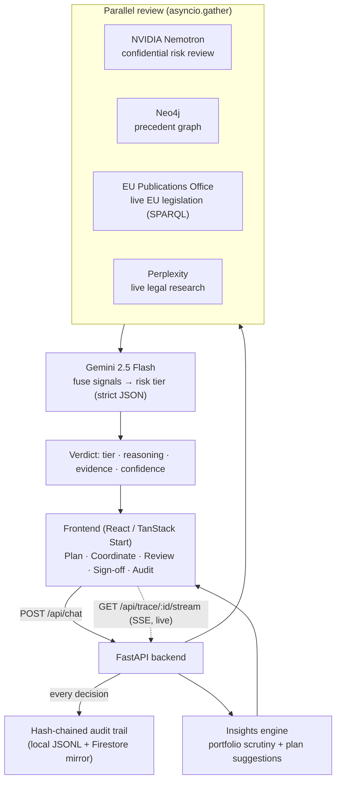

# SignOff

**An oversight control tower for supervising AI-assisted legal work.**

Most legal-AI tools help *do* the work — drafting, summarising, first-pass
review. SignOff is built for the people who have to **supervise and stand behind
that work**: partners, counsel and senior associates. As AI raises output
volume, the bottleneck shifts from *doing* to *overseeing*. SignOff gives a
supervisor one place to plan a matter, coordinate who (and which AI) works on
it, review the output with the AI's reasoning laid bare, and sign off — with a
tamper-proof record of every decision.

Built with a Clifford Chance supervision workflow in mind.

> **Solution in brief.** SignOff is a supervision layer that sits *above* the
> legal-AI tools doing the drafting. A supervising lawyer plans a matter (with
> risk limits and AI reviewers), coordinates the work on a board, reviews each
> clause with a parallel multi-model risk verdict (NVIDIA Nemotron, a Neo4j
> precedent graph, live EU legislation, and Perplexity research, fused by Gemini),
> and signs off — while every decision streams to the screen live and is written
> to a tamper-proof, hash-chained audit trail. A portfolio-learning layer then
> turns the accumulated record into proactive planning suggestions. It runs fully
> end-to-end with **no credentials** (demo mode) and flips each integration to
> **live** when its key is present.

---

## Contents

- [The supervision lifecycle](#the-supervision-lifecycle)
- [What it does](#what-it-does)
- [Architecture](#architecture)
- [Tech stack & live-vs-demo](#tech-stack--live-vs-demo)
- [Quickstart](#quickstart)
- [Repository map](#repository-map)
- [API reference](#api-reference)
- [How it maps to the judging criteria](#how-it-maps-to-the-judging-criteria)
- [Honest limitations](#honest-limitations)
- [License](#license)

---

## The supervision lifecycle

The whole product is organised around the four stages a supervisor actually
moves through. Each stage is a screen.

```
   (1) PLAN    ──►   (2) COORDINATE   ──►   (3) REVIEW    ──►   (4) SIGN OFF
   Set the risk      Track who/what          Read the AI's        Approve / amend /
   limits & pick     works each              findings, reasoning  reject, with the
   AI reviewers      workstream              & evidence           decision recorded
```

| Stage | Screen | What the supervisor does |
| --- | --- | --- |
| **1. Plan** | `/plan` | Define a new matter's risk limits, scope and red-lines, and choose its AI reviewers. The app **proactively suggests** a setup learned from comparable matters. |
| **2. Coordinate** | `/coordinate/:id` | A kanban board showing each workstream moving across the review pipeline. |
| **3. Review** | `/matter/:id` | The clause workspace: each clause gets a risk tier, the AI's reasoning, supporting evidence, a live confidence signal, and live execution traces. |
| **4. Sign off** | `/matter/:id` | Approve, amend or reject — capturing any **override** of the AI and writing a tamper-proof audit record. |
| **Portfolio** | `/` | The ledger: every matter, its stage, and a "what to scrutinise" insights panel across the whole portfolio. |
| **Audit** | `/audit` | The portfolio-wide, verifiable decision record. |

---

## What it does

The brief named four things a good supervision tool must do. SignOff implements
all four, plus a learning layer.

- **Supervisory controls** — explicit approve / amend / reject, an **override**
  flag captured whenever the supervisor departs from the AI's recommendation,
  and configurable risk limits and escalation tiers per matter.
- **Risk signalling** — every clause is rated Tier 1 (routine) / 2 (material) /
  3 (escalate), with a **confidence meter** and an explicit warning when the AI
  is uncertain, so a human looks harder exactly where it matters.
- **Transparency** — the multi-agent review streams **live execution traces**
  (which model/source ran, live or demo, how long it took) to the screen as it
  happens, and every recommendation shows its sources and per-reviewer reasoning.
- **Auditability** — every analysis, plan and sign-off is written to an
  append-only, **SHA-256 hash-chained** record that is re-verified on every read,
  so any later edit or deletion is provable.
- **Portfolio learning** *(the "gets better over time" part)* — the system reads
  the whole portfolio to (a) surface cross-matter patterns a partner should
  scrutinise, and (b) **proactively suggest how to plan a new matter** based on
  comparable past matters. Suggestions sharpen as more matters are added.

---

## Architecture

A React (TanStack Start) frontend talks to a Python FastAPI backend. For a
clause review, the backend fans out several specialist models/sources **in
parallel**, then fuses their signals into a single risk verdict — streaming each
step to the UI and recording the outcome to the audit trail.



Two design choices worth calling out:

1. **Honest by construction.** Every signal is labelled **Live** or **Demo** in
   the UI. The app runs fully end-to-end with zero credentials (demo mode), and
   each integration flips to live when its key is present — nothing is faked as
   live.
2. **Graceful degradation.** If any single reviewer fails, it returns a
   structured error instead of crashing; the review still produces a best-effort
   verdict.

See [`docs/ARCHITECTURE.md`](docs/ARCHITECTURE.md) for the file-by-file
breakdown, the request lifecycle, and how the hash chain, SSE streaming, and
insights engine work.

---

## Tech stack & live-vs-demo

| Capability | Technology | Live when… |
| --- | --- | --- |
| Frontend | React 19 + **TanStack Start**, Tailwind, shadcn/ui | always |
| API | Python **FastAPI** (async) | always |
| Synthesis / reasoning | **Vertex AI — Gemini 2.5 Flash** (strict JSON) | GCP credentials present |
| Confidential risk review | **NVIDIA Nemotron** (NIM, OpenAI-compatible API) | `NVIDIA_API_KEY` present |
| Precedent graph | **Neo4j** (async, Cypher) | Neo4j credentials present |
| EU legislation | **EU Publications Office** (Cellar SPARQL) | **always live** — public, key-less |
| Legal research | **Perplexity** (`sonar-reasoning`) | `PERPLEXITY_API_KEY` present |
| Durable audit mirror | **GCP Firestore** (async) | GCP credentials present |
| Tamper-proof audit | **SHA-256 hash chain** (local JSONL) | always |
| Live traces | **Server-Sent Events** | always |

Check what's live at any time: `GET /api/health`.

---

## Quickstart

The app runs with **no credentials** in demo mode. Backend on `:8000`,
frontend on `:8080`.

### Backend

```bash
cd backend
python -m venv .venv
# Windows:  .venv\Scripts\activate
# macOS/Linux:  source .venv/bin/activate

pip install -r requirements.txt
cp .env.example .env          # optional: fill in keys to go live
python main.py                # http://localhost:8000  (docs at /docs)
```

To enable live Google Cloud (Gemini + Firestore) for local dev:

```bash
gcloud auth application-default login
```

> **Keys go in `.env`, never in `.env.example`.** `.env` is gitignored;
> `.env.example` is a committed template. The backend reads `.env` from both
> `backend/` and the repo root.

### Frontend

```bash
cd frontend
npm install        # or: bun install
npm run dev        # http://localhost:8080
```

The frontend points at the backend via `frontend/.env` →
`VITE_API_BASE=http://localhost:8000`.

---

## Repository map

```
SignOff/
├── README.md                      ← you are here (start)
├── docs/
│   └── ARCHITECTURE.md            ← deep dive: request flow, audit chain, SSE, insights
│
├── backend/                       ← FastAPI service (the review engine)
│   ├── main.py                    ← app + all HTTP routes (the API surface)
│   ├── mesh.py                    ← parallel multi-agent review + Gemini synthesis
│   ├── tools.py                   ← the individual reviewers (Nemotron, Neo4j, EU, Perplexity)
│   ├── insights.py                ← portfolio learning: scrutiny patterns + plan suggestions
│   ├── audit.py                   ← tamper-proof hash-chained audit log
│   ├── events.py                  ← in-process event bus for live SSE traces
│   ├── matters.py                 ← the matter ledger + lifecycle (demo data)
│   ├── config.py                  ← settings + lazy clients + live/demo detection
│   ├── requirements.txt
│   ├── .env.example               ← config template (copy to .env)
│   └── Dockerfile                 ← Cloud Run image
│
└── frontend/                      ← React UI (TanStack Start)
    └── src/
        ├── routes/                ← one file per screen (file-based routing)
        │   ├── index.tsx          ← (1) Portfolio ledger + insights
        │   ├── plan.tsx           ← (1) Plan a matter + proactive suggestions
        │   ├── coordinate/$matterId.tsx  ← (2) Coordinate kanban
        │   ├── matter/$matterId.tsx      ← (3,4) Review workspace + sign-off
        │   ├── audit.tsx          ← portfolio audit trail
        │   ├── profile.tsx        ← account + settings (incl. light/dark)
        │   └── __root.tsx         ← app shell
        ├── components/
        │   ├── Brand.tsx          ← the logo/wordmark (theme-adaptive)
        │   ├── Lifecycle.tsx      ← the 4-stage stepper
        │   ├── icons.tsx          ← custom legal iconography
        │   └── ui/                ← shadcn/ui primitives
        └── lib/
            ├── api.ts             ← typed client — the single source of the API contract
            └── theme.ts           ← light/dark theme handling
```

---

## API reference

Matches `frontend/src/lib/api.ts`. Interactive docs at `/docs`.

| Method | Path | Purpose |
| --- | --- | --- |
| GET | `/api/health` | Integration status (`live` / `demo`) |
| GET | `/api/matters` | Portfolio ledger + summary |
| POST | `/api/matters` | Plan stage — register a new matter |
| GET | `/api/matters/{id}/tasks` | Coordinate board for one matter |
| GET | `/api/insights` | Cross-matter patterns to scrutinise |
| GET | `/api/insights/plan` | Proactive plan suggestion for a practice area |
| POST | `/api/chat` | Run the review on a clause / question |
| GET | `/api/trace/{session_id}/stream` | Live execution traces (SSE) |
| POST | `/api/signoff` | Record a sign-off decision (audit trail) |
| GET | `/api/audit` | Read the audit trail (optionally per matter) |
| GET | `/api/audit/verify` | Re-verify the hash chain is intact |

Example review:

```bash
curl -X POST http://127.0.0.1:8000/api/chat \
  -H "Content-Type: application/json" \
  -d '{
    "message": "The Seller shall indemnify the Buyer for all Losses on an uncapped basis without time limitation.",
    "session_id": "sess-123"
  }'
```

Returns a `classification` (tier + recommended posture + confidence), per-reviewer
`agents[]` reasoning, supporting `evidence[]`, and `traces[]`. **Tier
convention:** 1 = routine (approve), 2 = material (amend), 3 = escalate (reject).

---

## How it maps to the judging criteria

| Criterion | Where to look |
| --- | --- |
| **Solution** | The four-stage lifecycle (`/plan` → `/coordinate` → `/matter` → sign-off) implements the exact supervision brief, end to end. |
| **Technology** | Parallel multi-model review (`mesh.py`), live key-less EU legislation (`tools.py`), live SSE traces (`events.py`), hash-chained audit (`audit.py`). |
| **Transformation** | Built for oversight at portfolio scale — the ledger + insights engine (`insights.py`), not single-document tooling. |
| **Rigour / Impact** | Honest live/demo labelling, verifiable audit (`/api/audit/verify`), and confidence/uncertainty signalling on every recommendation. |
| **Investment** | A sharp buyer (supervising partners) and a pain that grows with AI adoption; personalised to a real firm's workflow. |
| **Overall** | Restrained, intentional design (custom legal iconography, serif/mono typography, light/dark), lawyer-friendly language throughout. |

---

## Honest limitations

In keeping with the rigour the brief asks for:

- The matter **ledger is illustrative demo data** — clients/counterparties are
  well-known public companies used purely as realistic placeholders.
- The AI risk findings have **not yet been benchmarked** against a lawyer's
  ground-truth labels; accuracy evaluation is the clearest next step.
- Portfolio learning currently derives from portfolio configuration and the
  audit trail; it is a transparent heuristic, not a trained model.
- "Live" vs "Demo" reflects exactly what is configured at runtime — see
  `/api/health`.

---

## License

Released under the [MIT License](LICENSE) — free to fork, use and build on.
Configuration secrets live in git-ignored `.env` files; `.env.example` is the
only committed template and contains placeholders only.
